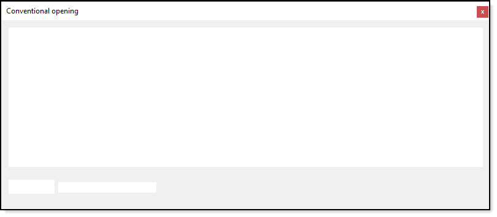

# About

Code sample that shows how the average coder might write code to read from a SQL-Server.

- When there is a bad connection
  - Server is not available
  - Something like a type'o in the connection string for whatever reason
  - Server name changes

The application will become unresponsive unlike in the project SqlServerReadAsync as shown in the screenshot below.

Run this project *as is* and the connection will fail. Once the MessageBox is closed use the *Load* button with the check box unchecked to see the application respond and load the data.

